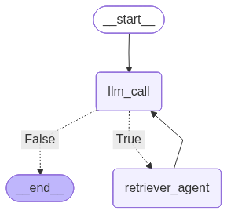

# RAG AI Agent

A RAG AI agent that answers questions about someone famous (in this case Bill Gates). It uses a **local PDF knowledge base** for biographical facts and **Tavily Web Search** for up-to-date information.

# Data Source
The included sample data (data_archive/billgates.pdf) is a compiled biographical summary based on Wikipedia. You can replace this with any PDF of your choice.

# Project Structure

To ensure the relative paths in the scripts work correctly, organize your project files as follows:

```text
project-root/
├── data_archive/           # Place your pdf here
├── chroma_db/              # Local vector database that is created in ingest.py
├── images/                 # The saved images
├── ingest.py               # Script to process PDF and create DB
├── ragagent.py             # Main chat application logic
├── requirements.txt        # Python dependencies
├── .env                    # API Keys (.env_example can be renamed)
└── README.md               # Documentation
```

# Architecture graph



## Features

* **Hybrid Search:**
    * **Local Retrieval:** Checks a local PDF document first using vector similarity search (ChromaDB).
    * **Web Fallback:** If the PDF doesn't have the answer, it autonomously searches the web using the Tavily API.
* **Cost Efficient:** Database ingestion is separated from the chat logic to avoid re-embedding documents on every run.
* **Stateful Agent:** Uses `LangGraph` to manage the decision-making loop between the LLM and the tools.

## Prerequisites

* Python 3.9+
* An **OpenAI API Key**
* A **Tavily API Key** (for web search)

## Installation

1.  **Clone the repository:**
    ```bash
    git clone [https://github.com/YOUR_USERNAME/bill-gates-rag-agent.git](https://github.com/YOUR_USERNAME/bill-gates-rag-agent.git)
    cd bill-gates-rag-agent
    ```

2.  **Create a virtual environment (Recommended):**
    ```bash
    python -m venv venv
    # Windows:
    venv\Scripts\activate
    ```

3.  **Install dependencies:**
    ```bash
    pip install -r requirements.txt
    ```

## Configuration

1.  **API Keys:**
    Create a file named `.env` in the root directory and add your keys:
    ```ini
    OPENAI_API_KEY=sk-...
    TAVILY_API_KEY=tvly-...
    ```

2.  **Data Setup:**
    * Create a folder named `data_archive` in the root directory (if it doesn't exist).
    * Place your `namehere.pdf` file inside `data_archive/`.

## Usage

### Step 1: Ingest Data (Run Once)
Before chatting, you must create the vector database. This processes the PDF and saves it locally.

```bash
python ingest.py
```
*Output: This will create a `chroma_db` folder in your directory.*

### Step 2: Run the Agent

Once the database is created, you can run the chat agent as many times as you like.

```bash
python ragagent.py
```
## Interaction:
* The application asks for the name of the person at the beginning (Defaults to Bill Gates).
* Type your question when prompted.
* Type exit or quit to stop the program.
